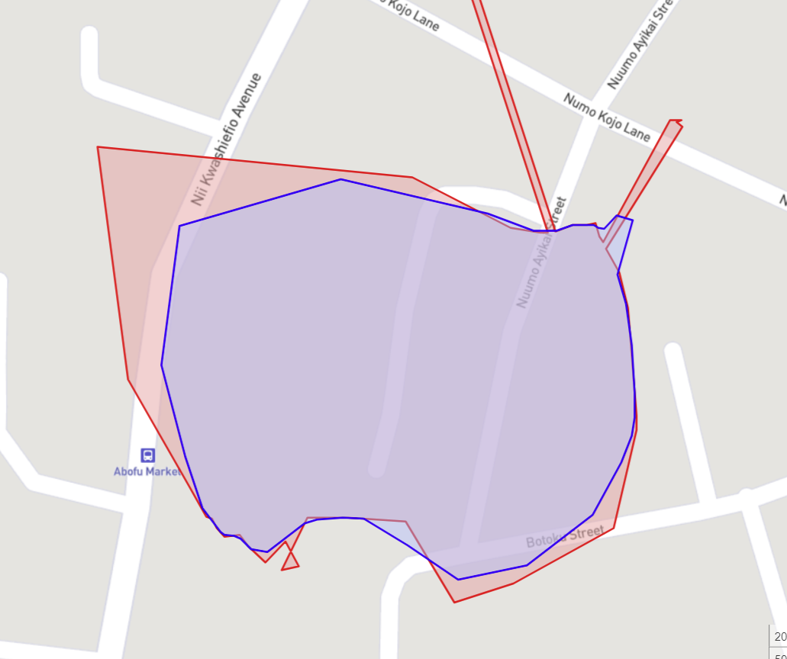
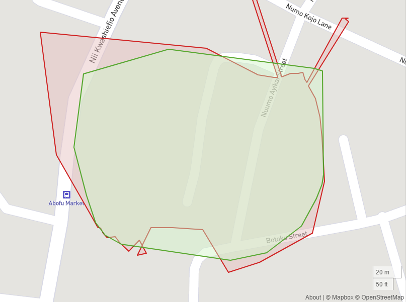
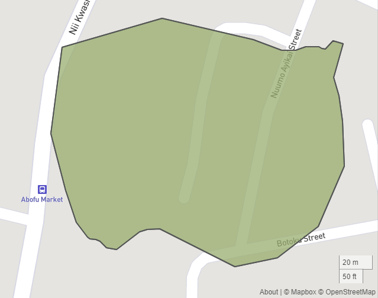

# gps-polygon-smoothers
Utility functions for smoothing GPS polygons

## Include PolygonSmoother into your project
Include PolygonSmoother.py in your project however you want

## Install dependencies
Install the follwoing dependencies in your environment
1. geopy
1. trianglesolver
1. scipy

## Run the test functions in PolygonSmootherTest.py
```python
test_map_cleaner()
```
### Output
The red polygon shows the original bad polygon
The blue polygon shows smoothed out polygon


## Clean your polygons with extensive smoothing.
Extensive smoothing applies the convex-hull algorithm in the smoothing process
```python
test_convex_hull()
```
### Output
The red polygon shows the original bad polygon
The green polygon shows smoothed out polygon


## Reduce the number of coordinates
If there are too many coordinates in a polygon, you can smartly remove some coordinates to reduce the number
without significantly impacting the overall outline of the original polygon
```python
test_reduce_point()
```

### Output
The red polygon shows the original polygon with 52 coordinates
The green polygon shows reduced polygon with just 30 coordinates as define in the function call
of course you can't see any red polygons - that's because the green polygon (with 30 coordinates) still perfectly overlays the red polygon (with 52 coordinates)

